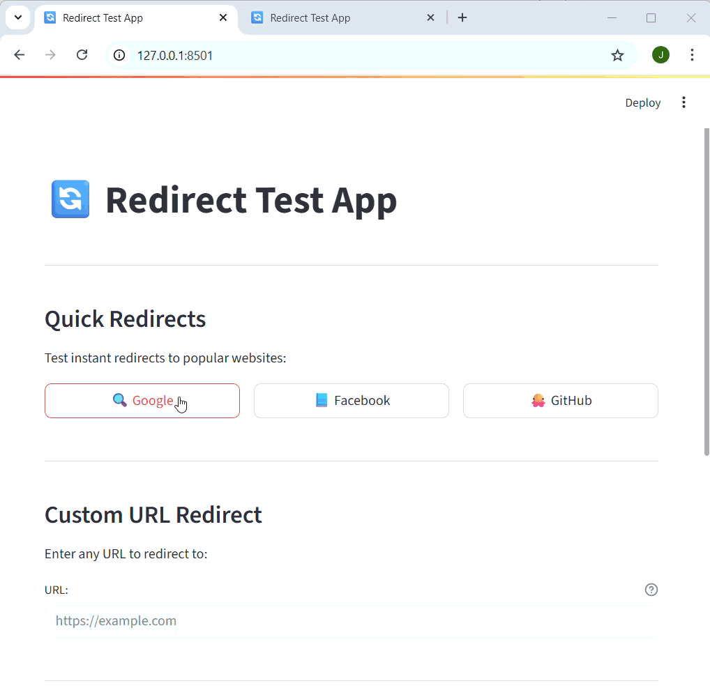

# streamlit-redirect

A lightweight Streamlit component for performing page redirects programmatically. This component is helpful when you need to redirect users to external URLs, for instance after a button click, form submission, or successful login.





## Features

- 🚀 Simple programmatic redirects in Streamlit apps
- 🎯 Lightweight implementation using HTML meta refresh
- ✅ Easy integration with existing Streamlit workflows

## Installation

```bash
pip install streamlit-redirect
```

## Quick Start

```python
import streamlit as st
from streamlit_redirect import redirect

st.title("My App")

# Redirect after button click
if st.button("Go to Google"):
    redirect("https://www.google.com")

# Redirect based on user input
url = st.text_input("Enter a URL:")
if url:
    redirect(url)
```

## API Reference

### `redirect(url: str)`

Redirects the current page to the specified URL.

**Parameters:**
- `url` (str): The target URL to redirect to. External websites must include the protocol (`http://` or `https://`)

**Note:** The redirect function inserts a `<meta http-equiv="refresh">` tag in the page header to perform the redirect. Make sure to only use trusted URLs to prevent security issues.

## Examples

### Basic Button Redirect

```python
import streamlit as st
from streamlit_redirect import redirect

st.title("Welcome to My App")

col1, col2, col3 = st.columns(3)

with col1:
    if st.button("🏠 Home", use_container_width=True):
        redirect("https://mywebsite.com")

with col2:
    if st.button("📧 Contact", use_container_width=True):
        redirect("https://mywebsite.com/contact")

with col3:
    if st.button("📱 About", use_container_width=True):
        redirect("https://mywebsite.com/about")
```

### Conditional Redirect After Form Submission

```python
import streamlit as st
from streamlit_redirect import redirect

st.title("Login Form")

with st.form("login_form"):
    username = st.text_input("Username")
    password = st.text_input("Password", type="password")
    submitted = st.form_submit_button("Login")
    
    if submitted:
        # Your authentication logic here
        if authenticate_user(username, password):
            st.success("Login successful! Redirecting...")
            redirect("https://myapp.com/dashboard")
        else:
            st.error("Invalid credentials")
```

### URL Validator with Redirect

```python
import streamlit as st
from streamlit_redirect import redirect
import re

def is_valid_url(url):
    pattern = re.compile(
        r'^https?://'  # http:// or https://
        r'(?:(?:[A-Z0-9](?:[A-Z0-9-]{0,61}[A-Z0-9])?\.)+[A-Z]{2,6}\.?|'  # domain...
        r'localhost|'  # localhost...
        r'\d{1,3}\.\d{1,3}\.\d{1,3}\.\d{1,3})'  # ...or ip
        r'(?::\d+)?'  # optional port
        r'(?:/?|[/?]\S+)$', re.IGNORECASE)
    return pattern.match(url) is not None

st.title("URL Redirector")

url_input = st.text_input(
    "Enter a URL to redirect to:",
    placeholder="https://example.com"
)

if url_input:
    if is_valid_url(url_input):
        st.success(f"✅ Valid URL: {url_input}")
        if st.button("Redirect Now"):
            redirect(url_input)
    else:
        st.error("❌ Please enter a valid URL with http:// or https://")
```

### Delayed Redirect with Countdown

```python
import streamlit as st
from streamlit_redirect import redirect
import time

st.title("Redirect with Countdown")

if st.button("Start Countdown Redirect"):
    placeholder = st.empty()
    
    for i in range(5, 0, -1):
        placeholder.info(f"Redirecting to Google in {i} seconds...")
        time.sleep(1)
    
    placeholder.success("Redirecting now!")
    redirect("https://www.google.com")
```

## Security Considerations

- Always validate URLs before redirecting to prevent malicious redirects
- Only redirect to trusted domains when possible
- Consider implementing a whitelist of allowed domains for production applications
- Be cautious with user-provided URLs

## How It Works

The `streamlit-redirect` component works by injecting a HTML meta refresh tag into the page:

```html
<meta http-equiv="refresh" content="0; url=https://example.com">
```

This causes the browser to immediately redirect to the specified URL. The component uses Streamlit's `st.markdown()` with `unsafe_allow_html=True` to insert this tag.

## Requirements

- Python >= 3.11
- Streamlit >= 1.48

## Contributing

Contributions are welcome! Please feel free to submit a Pull Request.

## License

This project is licensed under the Apache-2.0 License - see the [LICENSE](LICENSE) file for details.

## Support

If you encounter any issues or have questions, please file an issue on the [GitHub repository](https://github.com/EvobyteDigitalBiology/streamlit-redirect).